# Dell T5810 Hackintosh (Xeon E5-26xx, AMD GPU, OpenCore/Clover, PowerMac G5 Case)

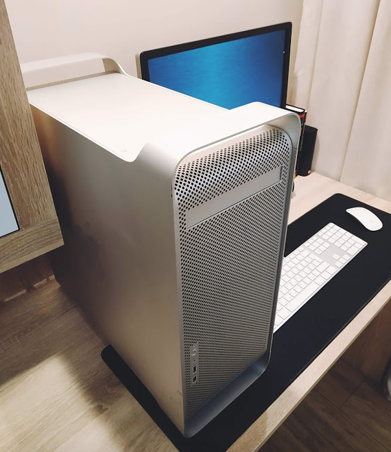

[Русская версия](src/rU.md)

OK. This branch contains the OpenCore/Clover bootloader archives for running the Mac OS 10.13-10.15. Contains some notes and observations on the installation of the OS.

I didn't use the full Dell Precision Tower 5810 workstation, but only took the motherboard from it. Thanks to its geometry, this board is perfect for installation in a PowerMac G5 case, causing minimal damage to this case.

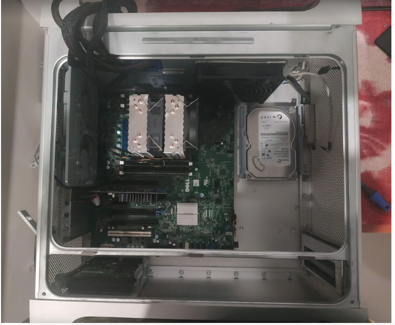

It's worth noting that synthetic benchmarks show better performance compared to Windows 10 (not to mention Linux). The indicators are 10-15% higher both for one core and for multi-cores.

### Hackintosh Features

At the moment, my system has the following characteristics:

| Accessories | Model |
| ----------------------- | ------------------------- |
| Motherboard | Dell T5810, C610 / 612 chip |
| CPU | Intel Xeon E5-2620 v3 |
| GPU | PowerColor Red Devil RX 570 4Gb |
| RAM | Hynix DDR4 32 Gb, 4x8 Gb 2133MHz ECC RDIMM (32 Gb) |
| WiFi/BT card | [Fenvi T919](https://aliexpress.ru/item/32778371977.html) |
| Case | Powermac G5 |
| NVME PCIEx16 adapter | [JEYI SK8-NEW](https://www.aliexpress.com/item/4000031943679.html) |
| CPU Cooling | Arsylid CN-609-P |
| Case cooling | 2x ARCTIC F9 PWM |
| PSU | Kolink KL-850M 80 Plus Bronze 850W |

For Mac OS, the NVME disk is Silicon Power P34A80 256GB M.2 2280 PCIe 3.0 x4 NAND TLC. It has very good read (3200 Mb / s) and write (3000 Mb / s) speeds, its cost is optimal (~$50), and is also easily determined by this operating system.

Since the motherboard doesnt have a connector for NVME drives, a PCIEx16 adapter was used, inserted into the second PCIEx16 slot. This motherboard can boot from such a solution, the performance indicators are maximum. In Mac OS, this drive appears as external, but this doesn't affect system performance or stability in any way.

I highly recommend using the Fenvi T919 WiFi/BT card. It's recognized by the operating system as native. You'll have no problems connecting to WiFi network, as well as using BTs magig keyboards, magic mouse and magic trackpads.

### Whats work

* video card and all its outputs (DVI, HDMI, DP)
* TurboBoost works
* works Speed Step
* all USB ports work, 2.0 and 3.0, including the port built into the motherboard
* sound works
* WiFi works (if you use my card)
* works BT (if you use my card)
* all PCIe slots work

### What doesn't work

* sleep and hibernation
* audio from HDMI and DispayPort video cards (if you don't use VoodooHDA)
* sound problems if you enable the virtualization option in the BIOS - **VT for Direct I/O**. The audio card stops working. This issue occurs with both AppleALC and VoodooHDA. It should be noted that the sound via HDMI and DispalyPort of the video card works fine.

### Motherboard specifications

|        |      |
|--------|------|
| chipset | Intel(R) C610, C612 |
| VRM    | 6's phase |
| RAM | 8xDIMM 2133/2400/2666 DDR4 RDIMM ECC, max — 256 Гб |
| PCI Express 3.0 x16 | 2x 16 GB/s |
| PCI Express 3.0 x8 | 1x 8 GB/s |
| PCI Express 2.0 x4 | 1x 2 GB/s |
| PCI Express 2.0 x1 | 1x 0.5 GB/s |
| PCI 2.3 (32 bit, 33 MHz) | 1x 133 MB/s |
| audio chip | Realtek ALC3220 (rebranding ALC280 chip) |
| Ethetnet | Intel i217 |
| SATA | 4xSATA 3.0 HDD; 2xSATA 3.0 ODD |
| USB | xUSB 3.0; 6xUSB 2.0 |

### Rear motherboard connectors

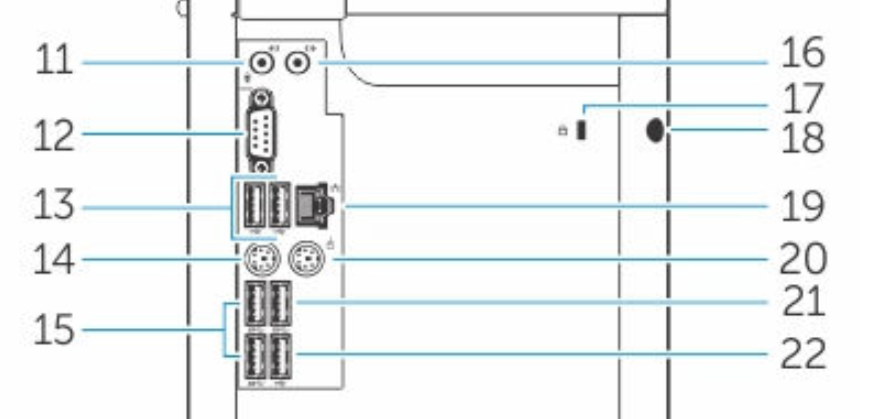

11. Line-in microphone jack
12. Serial port connector
13. USB 2.0 connectors
14. PS/2 keyboard connector
15. USB 3.0 connectors
16. Line-out connector
19. Network connector
20. PS/2 mouse connector
21. USB 3.0 connector
22. USB 2.0 connector

### Dell motherboard

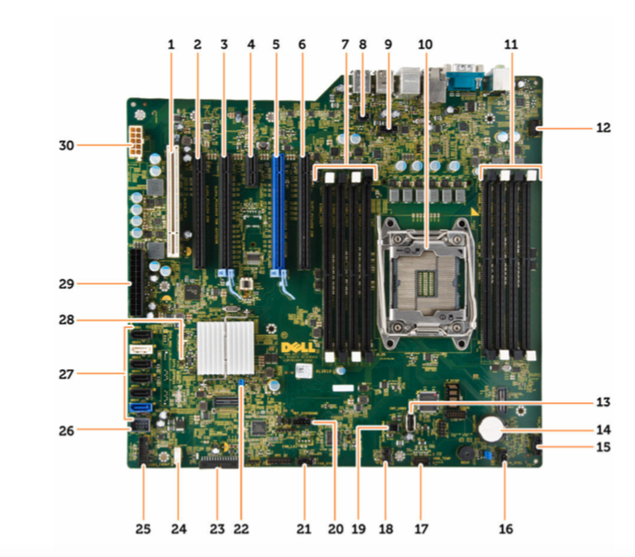

1. PCI slot (slot 6)
2. PCIe x16 slot (PCIe 2.0 wired x4) (slot 5)
3. PCIe 3.0 x16 slot (slot 4)
4. PCIe 2.0 x1 slot (slot 3)
5. PCIe 3.0 x16 slot (slot 2)
6. PCIe x16 slot (PCIe 3.0 wired x8) (slot 1)
7. DIMM slots
8. Tamper switch connector
9. CPU heatsink fan connector
10. CPU socket
11. DIMM slots
12. Front panel audio jack
13. Internal USB 2.0 connector
14. Coin cell battery
15. HDD fan connector
16. System fan connector
17. HDD temperature sensor connector 19. PWR_REMOTE connector (for Teradici Host Card) 21. system fan connector
18. System fan connector
19. PWR_REMOTE connector (for Teradici Host Card) 21. system fan connector
20. Thunderbolt connector
21. System fan connector
22. Password reset jumper
23. Front panel and USB 2.0 connector
24. Built-in speaker connector
25. USB 3.0 front panel
26. Internal USB 2.0 connector for FlexBay
27. SATA connectors (HDD0-HDD3 and SATA0-1)
28. Jumper RTC_RST
29. 24-pin power connector
30. CPU power connector

## BIOS settings

This motherboard is very moody to run the Mac OS operating system. And the whole problem is in the BIOS version. I was able to start the system on BIOS version A032, but later I received a critical error on allocating memory to internal devices, and the system didn't want to start. The solution was to downgrade to version A09. With this version, the system works absolutely stably.

**WARNING!** BIOS version A09 does NOT support Broadwell (E5 v4) processor series. Support for this series starts with BIOS A11.

**WARNING!** To downgrade to BIOS A09, you must first flash BIOS A11.

There is nothing difficult about flashing the BIOS. You need to download the correct version from the [official Dell website](https://www.dell.com/support/home/ru-ua/product-support/product/precision-t5810-workstation/drivers), write the **T5810Axx.exe** file to the USB flash drive, and when the computer starts, press F12, select the BIOS update and select this file on the USB flash drive.

BIOS settings differ slightly depending on the version. For example, unlike versions A32/A33, version A09 has items that allow you to fine-tune the BIOS. I don't understand why the manufacturer removed them in subsequent versions.

### BIOS settings for A09 version to start Mac OS.

**GENERAL**

* Boot Sequence.
    * Boot List Option: **[UEFI]**
* Advanced Boot Options.
    * Enable Legacy Option ROMs **[YES]**

**System Configurations**

* Integrated NIC
    * Enable UEFI Network Stack **[DISABLE]**
* Serial Port **[DISABLE]**
* SATA Operations **[ACHI]**
* Drives **[ALL CHECK]** (HDD-0, HDD-1, HDD-2, HDD-3, ODD-0, ODD-1)
* SMART Reporting **[NO]**
* USB Configuration **[ALL CHECK]** (Enable Boot Support, Front USB, Rear USB, Internal USB, USB 3.0 XCHI)
* Audio **[YES]**
* Memory Map IO above 4GB **[NO]**
* Thunderbolt **[NO]**
* Miscellaneous Devices
    * Enable PCI Slot **[NO]**
* PCI MMIO Space Size **[SMALL]**

**VIDEO**

* Primary Video Slot **[SLOT2: VGA Compatible]**

**Security**

Все **[DISABLE]**, кроме:
* Password Change
* CPU XD Support
* OROM Keyboard Access

**Secure Boot**

* Secure Boot Enabled **[DISABLE]**
* Expert Key Management **[DISABLE]**

**Performance**

* Multi Core Support **[06]** или **[ALL]** (зависит от версии BIOS, и количества физических ядер)
* Intel SpeedStep **[YES]**
* C-States **[YES]**
* Limit CPUID Value **[NO]**
* Intel TurboBoost **[YES]**
* HyperThread control **[YES]**
* System Isochronous Mode **[NO]**
* Cache Prefetch
    * Hardware Prefetcher **[YES]**
    * Adjacent Cache Prefetcher **[YES]**
* Dell Reliable Memory Technology (RMT) **[YES]**

**Power Management** 

* AC Recovery **[Power Off]**
* Deep Sleep Control **[DISABLE]**
* Fan Speed Control **[AUTO]**
* USB Wake Support **[DISABLE]**
* Wake on LAN **[DISABLE]**
* Block Sleep (S3 State) **[NO]**

**POST Behavior** 

* Numlock LED **[DISABLE]**
* Keyboard Errors Detection **[DISABLE]**
* Fasboot **[AUTO]**

**Virtualization Support**

* Virtualization **[ENABLE]**
* VT for Direct I/O **[DISABLE]**
* Trusted Execution **[NO]**

**Maintenance**

* SERR Message [DISABLE]

**Advanced Configurations**

* ASPM **[AUTO]**
* PCIe LinkSpeed **[AUTO]**

As mentioned earlier, the motherboard is very moody, and if you get such a critical error:

* for Clover

* for OpenCore

then you have a problem with the BIOS. All drivers, patches and kext to fix this error are installed. You either configured it incorrectly or your BIOS version has problems. Check your settings or flash a different BIOS version.

[BIOS A11](src/bios/A11.zip)  
[BIOS A09](src/bios/A09.zip)

## Bootloader

### Clover

[EFI](src/clover/BestEFI%20HighSierra%20UnknCPU.zip)

This bootloader is based on Clover. It is designed to fit 10.13 High Sierra installations.

[Documentation](https://sourceforge.net/p/cloverefiboot/wiki/Home/)

[Releases](https://github.com/CloverHackyColor/CloverBootloader/releases)

### OpenCore

[Bootloader realese](https://github.com/OreyM/Hackintosh-Dell-T5810-Xeon-E5-26xx-V3-OpenCore-PowerMac-G5/releases)

This bootloader allows you to run Mac OS 10.15 Catalina. The system works stably like a native one. Updated to the latest version.

Overall performance on par with MacPro 2013.

Note that you need to configure SMBIOS to activate Apple apps.

[Documentation](https://dortania.github.io/OpenCore-Install-Guide/prerequisites.html#prerequisites)

[OpenCORE Kernel & Kext patch for X99/X299 motherboard](https://www.insanelymac.com/forum/topic/341477-open-core-kernel-kext-patch-for-x99x299-motherboard/)

## Hardware and software lifehacks

### Case cooling

At the moment, for blowing out hot air, a native solution from Apple is used, but replacing the coolers with 90mm ARCTIC F9 PWM. Coolers are very quiet, connected to a 4-pin connector on the motherboard, and are responsible for blowing out. It turned out to be a very effective solution.

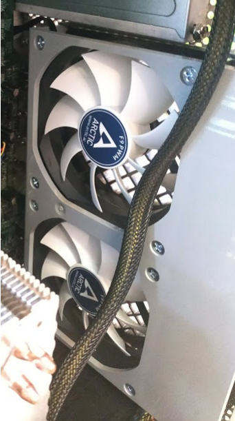

### PSU

In this project, the Kolink KL-850M power supply is used. A very good block. It was decided to integrate it into the case from the native Powermac G5 power supply. The element base fits perfectly in it.

### Connecting motherboard power

In addition to the standard 24-pin motherboard connector, additional 12V must be connected. I took them from a 6-pin video card power cable.

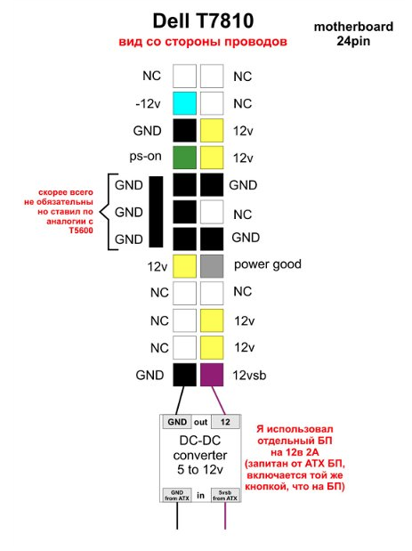
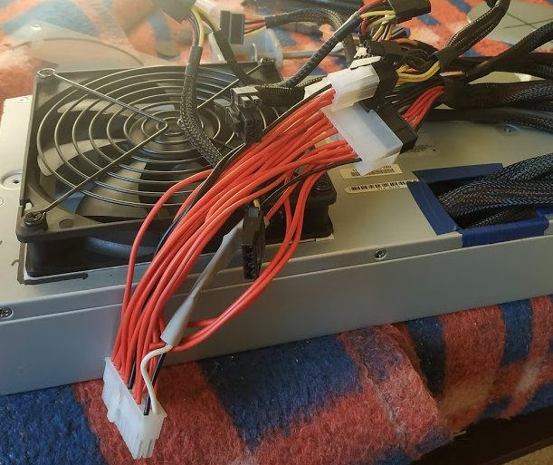

### Connecting CPU power

Please note that the processor power input is 10-pin. To power it, we need an 8-pin power cable (or take it from a 6-pin video card power cable through adapters). It is connected with yellow wires inward, the connectors are scattered around the edges. The two middle pins on the board connector are empty.

### Powermac G5 front panel pinout

To connect to the front panel of the Powermac G5, a native connector is used:

As well as standard IBM PC cables:

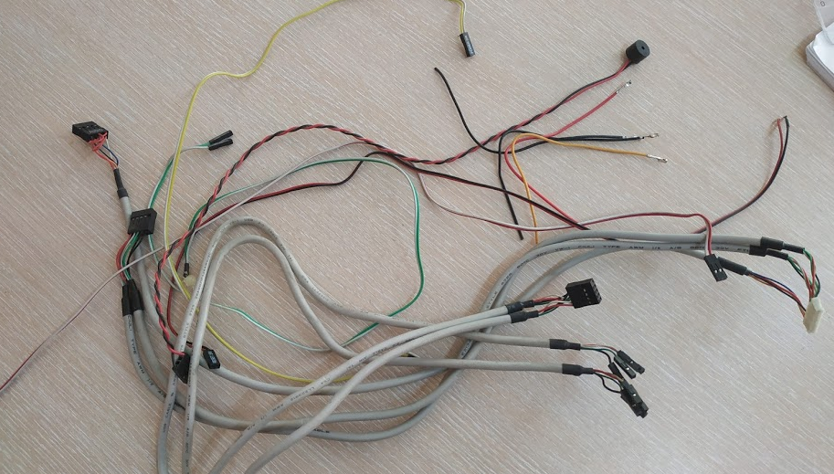

Connector pinout:

Standard motherboard pinout (NOT Dell T5810, there are nuances in audio)

The signed pins are marked in green on the AUDIO connector.

Power button connection:

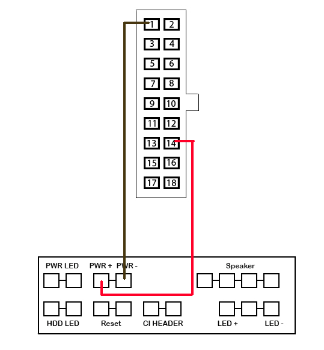

USB connection:

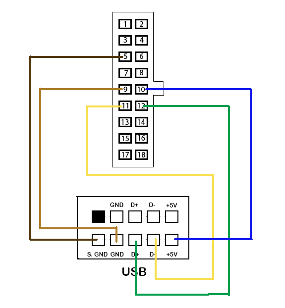

Audio input connection:

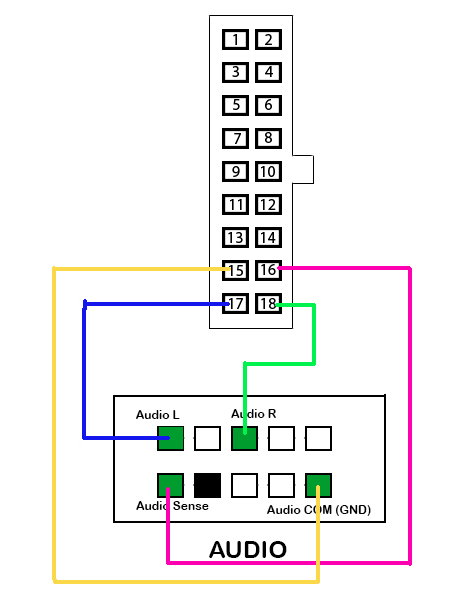

Although its connection is not more difficult than the same USB input, there is one caveat. Apple is showing off, and it works a little differently than we are used to. I mean, when you plug in some device, the sound will not go to it. It is necessary to manually switch the audio output source in the operating system panel. According to the logic of the pinout of the front panel cable, the 16th pin should be responsible for the same operation. But no ... Although most likely, it works as it should, but only on motherboards from Apple.

FireWire connection:

### Status LED connection

The LED indicator cable is located here, and connects like this:

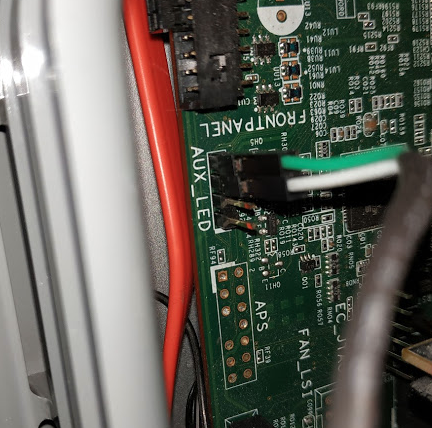

### Sound launch

The motherboard uses a **Realtek ALC280** chip. OpenCore has two kext - AppleALC and VoodooHDA.

AppleALC gives better sound quality and it really is. Sound quality like an iMac or Macbook Pro.

Unfortunately, VoodooHDA will show a mediocre sound, but sufficient for an undemanding user. At the moment, the advantage of VoodooHDA is that it works with sound from HDMI and DisplayPort video cards (**information is being verified**). I use AppleALC and it is activated in OpenCore.

If at the moment the sound from the video outputs of your video card is critical for you, just deactivate AppleALC in OpenCore and activate VoodooHDA.

For sound factory (via AppleALC) layout 13 is required (**information is being verified**). Other layout: `3, 4, 11, 13, 15, 16, 21`.

[OpenCore instruction](https://dortania.github.io/OpenCore-Post-Install/universal/audio.html#fixing-audio-with-applealc)

### Connecting the video card power

If your video card has external power supply (and all recommended cards do, with the exception of the RX550), then most likely the power outlet will be located at the top of the video card. In this case, you cannot close the plastic (transparent) bezel from the Powermac G5.

To solve this problem, I recommend using [this adapter](https://aliexpress.ru/item/4000079935335.html). 

### WiFi/BT cards

Use only PCI cards. Do not use USB. Look for cards with a Broadcomn chipset like BCM94360CS2 or BCM943602CS. Search on AliExpress for `Hackintosh WiFi`. At the moment, the most optimal Fenvi T919 - it is defined by Mac OS as native, there is no need to install drivers.

### BT connection on Fenvi T919 card

For BT connection, this card requires USB connection. A standard INNER connector is used, which can cause you problems if this connector is already used on your motherboard, or it is one of a kind (as on the Dell T5810). My solution was to use [this adapter](https://aliexpress.ru/item/4000130915121.html).

### CPU cooler pinout

It should be noted that the cooler's power connector is 5-pin.

## CPU Banch

| CPU                    | Core  | PBF/MTF GHz  | Cache L3  | TDP   | Max C° | Overall | **%**    | SCore | **%**    | MCore | **%**    | Price |
|------------------------|-------|--------------|-----------|-------|--------|---------|----------|-------|----------|-------|----------|-------|
| Intel Core i7-9700     | 8/8   | 3.0 / 4.7    | 12 Mb     | 65 W  | 100°   | 8783    | **104%** | 5829  | **143%** | 30724 | **109%** | 390$  |
| Intel Core i3-8100     | 4/4   | 3.6 / 3.6    | 6 Mb      | 65 W  | 100°   | 3874    | **46%**  | 4928  | **132%** | 14714 | **48%**  | 130$  |
| AMD Ryzen 7 2700       | 8/16  | 3.2 / 4.1    | 16 Mb     | 65 W  | 95°    | 9325    | **110%** | 4687  | **129%** | 25781 | **92%**  | 175$  |
| AMD Ryzen 5 1600       | 6/12  | 3.2 / 3.6    | 16 Mb     | 65 W  | 95°    | 6817    | **81%**  | 5167  | **135%** | 24095 | **86%**  | 103$  |
| Intel Xeon E5-1620 v3  |  4/8  | 3.5 / 3.6    | 10 Mb     | 130 W | 70°    | 4034    | **48%**  | 3811  | **112%** | 14196 | **51%**  | 33$   |
| Intel Xeon E5-1630 v3  |  4/8  | 3.7 / 3.8    | 10 Mb     | 140 W | 66.2°  | 4533    | **54%**  | 4417  | **124%** | 15976 | **57%**  | 46$   |
| Intel Xeon E5-1650 v3  | 6/12  | 3.5 / 3.8    | 15 Mb     | 140 W | 66.7°  | 6446    | **77%**  | 4884  | **131%** | 24751 | **88%**  | 102$  |
| Intel Xeon E5-1660 v3  | 8/16  | 3.0 / 3.5    | 20 Mb     | 140 W | 65.9°  | 7269    | **87%**  | 4916  | **132%** | 28979 | **103%** | 235$  |
| Intel Xeon E5-1680 v3  | 8/16  | 3.2 / 3.8    | 25 Mb     | 140 W | 66.26° | 7968    | **95%**  | 5652  | **141%** | 32720 | **124%** | 290$  |
| Intel Xeon E5-2620 v3  | 6/12  | 2.4 / 3.2    | 15 Mb     | 85 W  | 72.6°  | 4750    | **57%**  | 3849  | **113%** | 19050 | **68%**  | 14$   |
| Intel Xeon E5-2630 v3  | 8/16  | 2.4 / 3.2    | 20 Mb     | 85 W  | 72.1°  | 6138    | **73%**  | 3820  | **122%** | 22642 | **81%**  | 82$   |
| Intel Xeon E5-2630L v3 | 8/16  | 1.8 / 2.9    | 20 Mb     | 55 W  | 60.4°  | 4500    | **50%**  | 3178  | **95%**  | 13994 | **50%**  | 36$   |
| Intel Xeon E5-2640 v3  | 8/16  | 2.6 / 3.4    | 20 Mb     | 90 W  | 74.3°  | 6310    | **75%**  | 3871  | **114%** | 21155 | **75%**  | 68$   |
| Intel Xeon E5-2650 v3  | 10/20 | 2.3 / 3.0    | 25 Mb     | 105 W | 78.9°  | 7261    | **86%**  | 3584  | **107%** | 23971 | **85%**  | 62$   |
| Intel Xeon E5-2660 v3  | 10/20 | 2.6 / 3.3    | 25 Mb     | 105 W | 79°    | 7938    | **95%**  | 3458  | **103%** | 24289 | **87%**  | 86$   |
| Intel Xeon E5-2670 v3  | 12/24 | 2.3 / 3.1    | 30 Mb     | 120 W | 84.5°  | 7828    | **93%**  | 3616  | **107%** | 24316 | **87%**  | 90$   |
| Intel Xeon E5-2678 v3  | 12/24 | 2.5 / 3.3    | 30 Mb     | 120 W | 66.4°  | 8396    | **100%** | 3347  | **100%** | 28074 | **100%** | 105$  |
| Intel Xeon E5-2680 v3  | 12/24 | 2.5 / 3.5    | 30 Mb     | 120 W | 82.5°  | 8965    | **106%** | 3356  | **100%** | 26862 | **96%**  | 137$  |
| Intel Xeon E5-2690 v3  | 12/24 | 2.6 / 3.5    | 30 Mb     | 135 W | 89.9°  | 9564    | **112%** | 4026  | **117%** | 30206 | **107%** | 240$  |

* PBF - Processor Base Frequency
* MTF - Max Turbo Frequency

## RESULT

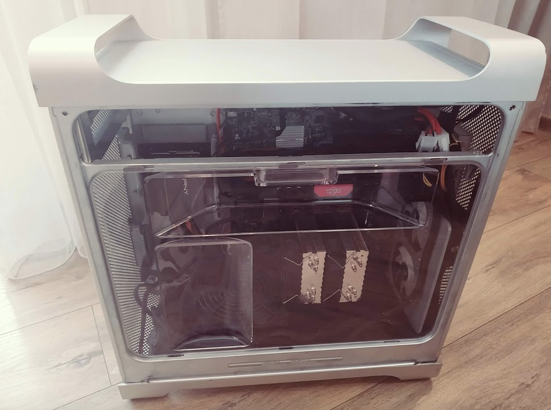

## Thanks

Special thanks to [sebaxakerhtc](https://w3bsit3-dns.com/forum/index.php?showuser=2092640), [antico](https://w3bsit3-dns.com/forum/index.php?showuser=4709617) and [lonehune](https://w3bsit3-dns.com/forum/index.php?showuser=3977977). These guys helped with the programmatic part of setting up the startup and normal operation of Mac OS.